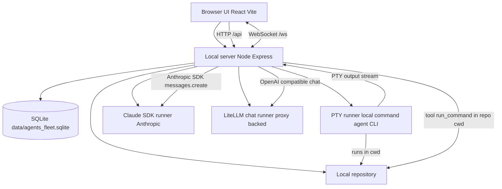

# Architecture

This project is local-first. The browser UI talks to a local Node server which can:

1) spawn a PTY to run a command/agent CLI inside a repository,
2) run a Claude SDK-backed chat session (Anthropic SDK) with tool-calling, or
3) run a LiteLLM-backed chat session through an enterprise/custom proxy.

All modes persist session state + artifacts to SQLite and stream live events back over WebSockets.

## SQLite schema (MVP)

The server persists everything to a local SQLite DB at `data/agents_fleet.sqlite`.

| Table | Purpose | Why it exists |
|---|---|---|
| `sessions` | One row per run (command + repo, timestamps, status, budgets, token/cost estimates, stop reason) | Lets the UI list sessions, show status/metadata, and enforce budgets |
| `pty_chunks` | Raw PTY output stream chunks (ANSI included) keyed by `session_id` and `timestamp` | Enables **Terminal (persisted)** by replaying through xterm.js (faithful scrollback for TUIs) |
| `stdin_events` | Audit trail of user input sent to the PTY (bounded/escaped) | Useful for debugging/auditing without corrupting terminal replay |
| `session_markers` | Important timestamps like `stop_requested`, `budget_exceeded`, `process_exit` | Supports replay UX (e.g. freezing replay before TUI cleanup) and debugging session lifecycle |
| `session_artifacts` | Per-session artifacts keyed by `session_id` | Stores git snapshots plus chat/session artifacts (transcripts, usage snapshots, tool approvals/results) for later inspection/export |

## Notes
- Interactive agent CLIs (e.g. Claude Code, Codex) render a full-screen TUI via ANSI escape codes.
- **Terminal (live)**: rendered from the live PTY stream over WebSocket using xterm.js.
- **Terminal (persisted)**: reads `pty_chunks` from SQLite and replays through xterm.js to provide scrollback/history.
- Replay strips alternate-screen enter/exit sequences so TUI output stays in the main scrollback buffer.
- Input auditing is stored separately (`stdin_events`) and is not injected into the terminal replay stream.

### Claude SDK chat + tools
- Claude SDK sessions are stored in the same `sessions` table with command `[claude-sdk]`.
- Transcript messages are stored as artifacts:
  - `claude_sdk_user_message_v1`
  - `claude_sdk_assistant_message_v1`
- Tooling is implemented via Anthropic tool-calling:
  - tool: `run_command` (shell command executed in `repo_path`)
  - user must Approve/Reject each tool call (decision persisted as `claude_sdk_tool_approval_v1`)
  - command outputs are stored as `claude_sdk_tool_result_v1`
  - tool output is capped (100KB) to protect context/budgets
- Usage snapshots are stored as `claude_sdk_usage_v1` and used for budget enforcement + UI display when available.

### LiteLLM chat + tools
- LiteLLM sessions use the same session lifecycle, budgets, and artifact model as Claude SDK.
- Requests are routed through an OpenAI-compatible LiteLLM proxy endpoint configured by `LITELLM_BASE_URL` and `LITELLM_API_KEY`.
- The UI supports model selection, chat history, and the same Approve/Reject workflow for tool calls.
- Tool outputs and usage are persisted so budget enforcement and replay remain consistent across providers.
