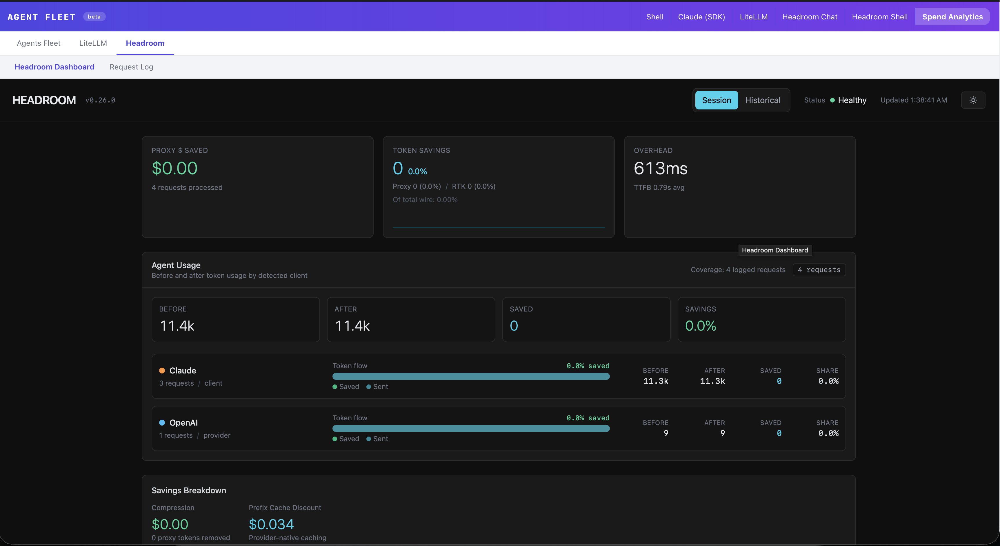
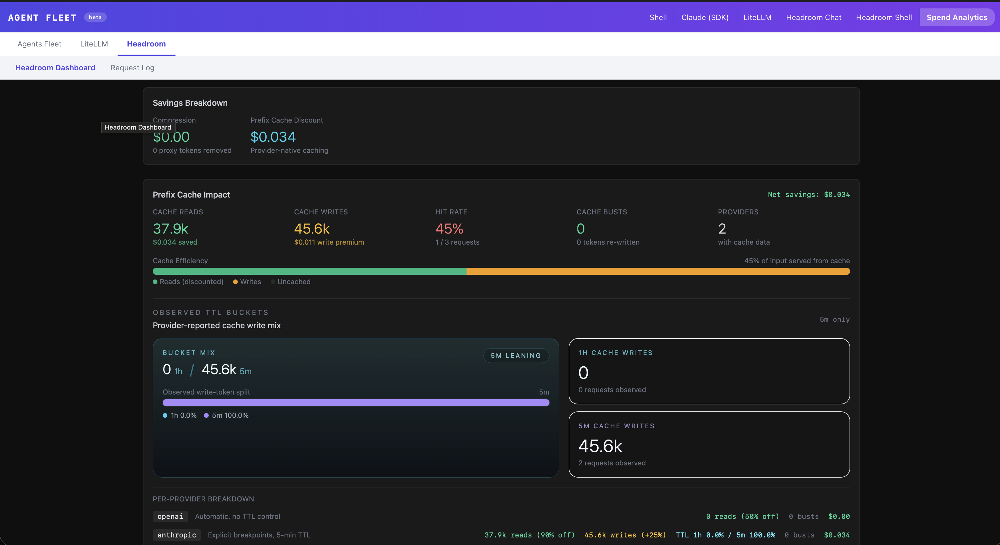
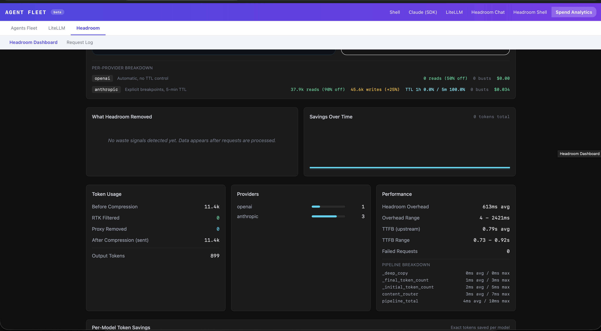
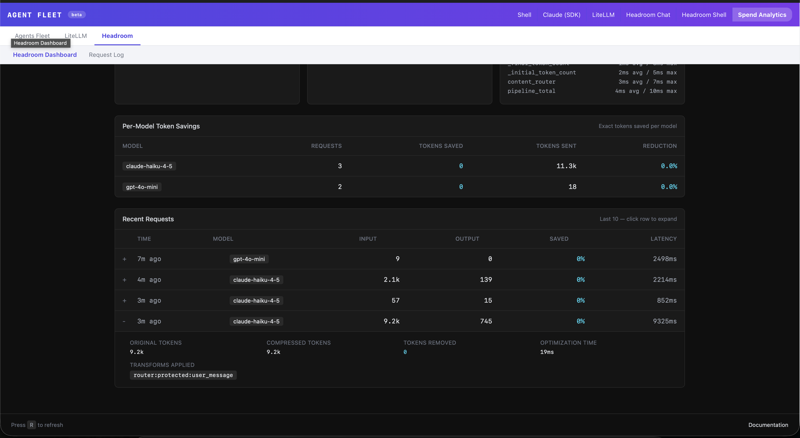
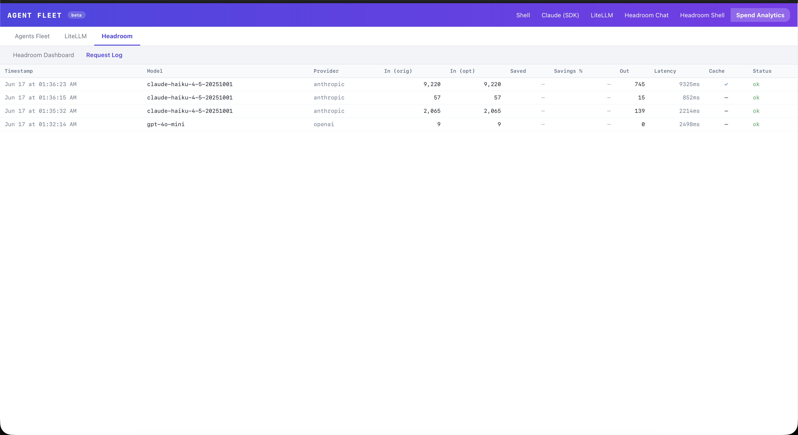

# Headroom Integration

Headroom is a local context-compression proxy that sits between AI Watchtower and
your LiteLLM endpoint. It intercepts each chat request, runs a compression pass
over the message history using an on-device ONNX model (kompress-v2-base), and
forwards the compressed prompt to LiteLLM. Only the compressed text leaves the
machine. The full, uncompressed conversation is never sent anywhere.

The measurable effect is fewer input tokens billed per turn. In early testing with
multi-turn coding conversations the reduction was around 19%. The proxy reports
cumulative savings persistently across restarts in ~/.headroom/proxy_savings.json.

This document covers setup, usage, debugging, configuration, privacy, and where to
find each piece of the implementation in the source tree.


## Screenshots

**Spend Analytics — Headroom session overview (agent usage + savings breakdown)**


**Prefix cache impact (cache reads, writes, hit rate)**


**Performance stats (token usage + pipeline breakdown)**


**Per-model token savings + recent requests**


**Request Log tab (per-request detail: model, tokens, latency, cache, status)**



## How compression works (conceptual)

1. You send a message in the Headroom tab.
2. The AI Watchtower server appends it to the conversation transcript and POSTs
   the full history to http://localhost:8787/v1/chat/completions (the proxy).
3. The proxy loads the kompress-v2-base ONNX model (already on disk after first run)
   and runs a semantic compression pass over the message history.
4. Compression only fires when the context window exceeds 500 tokens. Shorter
   conversations pass through unchanged.
5. The proxy forwards the (smaller) compressed history to LiteLLM at the URL
   configured in OPENAI_TARGET_API_URL.
6. The model's streamed response flows back through the proxy to the server and
   then to the browser over WebSocket.
7. Token counts reported in the session info bar reflect what LiteLLM actually
   billed (post-compression), not the original context size.


## Architecture

```
Browser (HeadroomChat.tsx)
        |
        | WebSocket (litellm_send)
        v
AI Watchtower server  (apps/server/src/routes/litellm.ts)
        |
        | runLiteLlmTurn() -- baseUrl = cfg.headroomBaseUrl
        | POST /v1/chat/completions
        v
Headroom proxy  (http://localhost:8787)
        |
        | semantic compression (kompress-v2-base, ONNX, local CPU/GPU)
        | POST /v1/chat/completions
        v
LiteLLM  (LITELLM_BASE_URL)
        |
        v
Upstream LLM provider  (OpenAI, Anthropic, etc.)
```

The proxy also exposes:
  GET /health  -- liveness check
  GET /stats   -- per-session and persistent lifetime savings


## Setup

### Automatic (recommended)

Run the one-command dev runner:

    pnpm dev:one

The script (scripts/dev) does the following in order:

1. Loads .env.local if it exists.
2. Prompts for LITELLM_API_KEY if not already set and writes it to .env.local.
3. Runs pnpm install if node_modules is absent.
4. Checks whether headroom is on PATH.
   - If not, prompts to install it: pip install headroom-ai httpx[http2]
5. Checks whether kompress-v2-base is cached at
   ~/.cache/huggingface/hub/models--chopratejas--kompress-v2-base
   - If not cached, starts the proxy online so it can download the model
     from HuggingFace (one-time, ~several hundred MB).
   - If already cached, sets HF_HUB_OFFLINE=1 before starting the proxy.
6. Launches the proxy: headroom proxy --port $HEADROOM_PORT
   with HEADROOM_TELEMETRY=off and stdout/stderr redirected to data/headroom.log.
7. Polls GET /health until the proxy responds (may take 60-90 s on first run
   while the model downloads and loads).
8. Runs pnpm dev (server + web).

The proxy is killed via a trap when the dev runner exits.

### Manual steps (if automatic setup fails or you want more control)

Install the Python package:

    pip install headroom-ai httpx[http2]

Download the model (one-time):

    headroom proxy --port 8787

Wait for the /health endpoint to respond, then Ctrl-C. The model is now cached.

On subsequent starts, set HF_HUB_OFFLINE=1 to prevent any HuggingFace network
calls:

    HEADROOM_TELEMETRY=off \
    HF_HUB_OFFLINE=1 \
    OPENAI_TARGET_API_URL=<your-litellm-base-url> \
    OPENAI_API_KEY=<your-litellm-api-key> \
    headroom proxy --port 8787

Leave this running in a separate terminal, then start the app with pnpm dev.


## Usage

### The Headroom tab

Open the app (default http://localhost:5173) and click the Headroom tab in the
header bar. The tab is separate from the LiteLLM tab but uses the same underlying
infrastructure server-side.

On load, HeadroomChat.tsx calls GET /api/dashboard/headroom/stats to check proxy
liveness. The header shows either:
  - A green "Proxy connected at http://localhost:8787" badge, or
  - An amber "Headroom proxy not running. Start with: pnpm dev:one" warning.

The message input is disabled while the proxy is offline.

### Starting a session

Fill in:
- Repo path (required) -- the directory the bash tool runs in.
- Model (required) -- selected from the shared LITELLM_CHAT_MODEL_OPTIONS list.
- Budget USD (optional) -- hard spend cap; session stops if the predicted cost
  would exceed it.

Click Send (or press Enter). The first message creates the session. The session
command is stored as [headroom-chat] in SQLite, distinguishing it from plain
LiteLLM sessions ([litellm-chat]).

The proxy URL is hardcoded in HeadroomChat.tsx:

    HEADROOM_PROXY_URL = "http://localhost:8787/v1"   (used for LLM calls)
    HEADROOM_PROXY_BASE = "http://localhost:8787"      (used for health/stats)

### What to expect

- First message: no compression (context < 500 tokens). Latency is similar to
  a direct LiteLLM call plus the proxy's model-load time.
- Subsequent messages: compression triggers once the running history exceeds
  500 tokens. You may notice a brief extra latency on turns where compression
  fires; this is the ONNX inference pass on your local CPU.
- Token counts in the session info bar (in / out / cost) reflect what LiteLLM
  reported after compression.

### Tool calls (bash)

The Headroom tab supports the same approve/deny bash tool flow as the LiteLLM
tab. The proxy is transparent to tool call handling; tool call JSON passes through
unchanged.


## Spend Analytics integration

The Spend Analytics tab (dashboard tab) shows a "Headroom" row in the
per-command breakdown table for sessions with command = [headroom-chat]. This is
handled by the same SQL GROUP BY command query used for all session types.

In addition, the Headroom tab itself shows a live stats card when the proxy is
running. The data comes from GET /api/dashboard/headroom/stats?url=<proxyUrl>,
which the server proxies to GET /health and GET /stats on the local headroom
process (3-second timeout each).

The stats payload shape (from apps/web/src/api.ts HeadroomStatsResponse):

  health:
    status         -- string, e.g. "ok"
    ready          -- bool
    uptime_seconds -- number
    version        -- string

  stats.summary:
    api_requests          -- total requests seen by proxy
    compression.total_tokens_removed
    compression.avg_compression_pct
    compression.requests_compressed
    cost.without_headroom_usd
    cost.with_headroom_usd
    cost.total_saved_usd
    cost.savings_pct

  stats.persistent_savings.lifetime:
    requests
    tokens_saved
    compression_savings_usd
    total_input_tokens

  stats.persistent_savings.display_session:
    requests
    tokens_saved
    savings_percent
    compression_savings_usd

Persistent savings survive proxy restarts and are stored by headroom itself at:

    ~/.headroom/proxy_savings.json


## Debugging

### Log file

All proxy stdout and stderr is captured at:

    data/headroom.log

Tail it while the proxy is running:

    tail -f data/headroom.log

The dev runner also cats this file if the proxy exits unexpectedly during startup.

### Verify the proxy is up

    curl -s http://localhost:8787/health | python3 -m json.tool

Expected response (abbreviated):

    {
      "status": "ok",
      "ready": true,
      "uptime_seconds": 42,
      "version": "..."
    }

### Fetch current stats

    curl -s http://localhost:8787/stats | python3 -m json.tool

### Verify requests are going through the proxy

Send a message in the Headroom tab, then check the log:

    grep -i "compress" data/headroom.log

Lines mentioning compression ratio or tokens removed confirm the proxy is
intercepting requests and running the model. If you see no compression lines, the
context is below the 500-token threshold.

You can also watch the proxy log live and confirm that POST /v1/chat/completions
appears each time you send a message:

    tail -f data/headroom.log | grep -i "POST\|compress\|error"

### Common errors

**"Headroom proxy not running" banner in the UI**
  The app tried GET /health and got no response. Ensure headroom is running:
    ps aux | grep headroom
  If not running, either use pnpm dev:one or start it manually (see Setup above).

**Proxy exits immediately on first run**
  The model download may have failed. Check data/headroom.log for HTTP errors.
  Try starting the proxy directly in a terminal (without HF_HUB_OFFLINE=1) so
  you can see the download progress and any pip/network errors.

**"pip install failed" during pnpm dev:one**
  The script tries pip3 then pip. If neither is available, install Python 3 and
  pip, then run:
    pip install headroom-ai httpx[http2]

**"LITELLM_BASE_URL is not set" warning in proxy log**
  The proxy starts but will attempt to call external OpenAI endpoints directly
  rather than routing through LiteLLM. Set LITELLM_BASE_URL in .env.local:
    export LITELLM_BASE_URL="http://your-litellm-host:4000"

**Context under 500 tokens -- no compression**
  This is expected behavior. Short single-turn exchanges are forwarded unchanged.
  Build up a longer conversation to trigger compression.

**LiteLLM returns 401 through the proxy**
  The proxy forwards the Authorization header from AI Watchtower. Confirm
  LITELLM_API_KEY matches what your LiteLLM instance expects.

**Proxy health check times out during pnpm dev:one**
  First run can take 60-120 seconds while the model loads into memory. The script
  polls every 2 seconds and prints elapsed time. Wait it out.


## Configuration

All configuration is via environment variables. Set them in .env.local (loaded
automatically by the dev scripts) or export them before running the proxy.

| Variable              | Default           | Description                                         |
|-----------------------|-------------------|-----------------------------------------------------|
| HEADROOM_PORT         | 8787              | Port the headroom proxy listens on                  |
| HEADROOM_TELEMETRY    | (unset)           | Set to "off" to disable all telemetry               |
| HF_HUB_OFFLINE        | (unset)           | Set to "1" after model download to prevent HF calls |
| HF_HOME               | ~/.cache/huggingface | Override HuggingFace cache root                  |
| OPENAI_TARGET_API_URL | (unset)           | Where headroom forwards requests; set to LITELLM_BASE_URL |
| OPENAI_API_KEY        | (unset)           | Forwarded as the Bearer token; set to LITELLM_API_KEY     |
| LITELLM_BASE_URL      | (unset)           | AI Watchtower server reads this for non-headroom sessions |
| LITELLM_API_KEY       | (unset)           | AI Watchtower server reads this for all LiteLLM calls     |

The proxy URL seen by the AI Watchtower server is stored per-session in SQLite as
the headroomBaseUrl field of the litellm_chat_config_v1 artifact
(apps/server/src/litellm.ts, LiteLlmConfigV1). It is hardcoded to
http://localhost:8787/v1 by HeadroomChat.tsx and cannot be changed from the UI.
To change the port, set HEADROOM_PORT before starting pnpm dev:one.

### Compression threshold

The 500-token minimum is a headroom-internal default. There is currently no
AI Watchtower-level knob to tune this. If you need a different threshold, refer
to the headroom-ai documentation (https://github.com/chopratejas/headroom).


## Privacy and security

All compression runs entirely on your machine:

- The kompress-v2-base model is a local ONNX file cached at
  ~/.cache/huggingface/hub/models--chopratejas--kompress-v2-base.
- After the first run (model download), HF_HUB_OFFLINE=1 is set so no further
  HuggingFace network calls are made.
- HEADROOM_TELEMETRY=off is set unconditionally by scripts/dev; the proxy sends
  no usage data to external services.
- The proxy process listens only on localhost. It is not bound to 0.0.0.0 and is
  not accessible from other machines on your network.

What does leave your machine:
- The compressed prompt, forwarded to LiteLLM at LITELLM_BASE_URL (which may be
  a remote host or a local proxy). This is the same data that would leave anyway
  in a non-headroom session, just smaller.
- The bearer token (LITELLM_API_KEY) forwarded by the proxy to LiteLLM.

What stays local:
- The full uncompressed conversation transcript (stored in SQLite at
  data/watchtower.db).
- The original message text before compression.
- The ONNX model weights.
- Proxy savings statistics (~/.headroom/proxy_savings.json).


## Codebase reference

| Concern                              | File                                                      |
|--------------------------------------|-----------------------------------------------------------|
| Headroom tab UI                      | apps/web/src/HeadroomChat.tsx                             |
| Proxy URL constants                  | apps/web/src/HeadroomChat.tsx (top of file)               |
| Tab routing / CommandBadge           | apps/web/src/App.tsx                                      |
| API client (getHeadroomStats)        | apps/web/src/api.ts                                       |
| HeadroomStatsResponse type           | apps/web/src/api.ts                                       |
| Session creation (POST /litellm/sessions) | apps/server/src/routes/litellm.ts                    |
| headroomBaseUrl -> [headroom-chat] command | apps/server/src/routes/litellm.ts (line ~93)        |
| LiteLlmConfigV1 type (headroomBaseUrl field) | apps/server/src/litellm.ts                       |
| baseUrl selection (headroom or LiteLLM) | apps/server/src/litellm.ts (runLiteLlmTurn)           |
| assertLiteLlmSession (headroom-chat guard) | apps/server/src/litellm.ts                          |
| Dashboard proxy endpoint for stats   | apps/server/src/routes/dashboard.ts (headroom/stats)      |
| Shared session/request types         | packages/shared/src/index.ts                              |
| Dev runner (install + launch)        | scripts/dev                                               |
| Proxy log file                       | data/headroom.log (runtime, gitignored)                   |
| Persistent savings                   | ~/.headroom/proxy_savings.json (outside repo)             |
| Model cache                          | ~/.cache/huggingface/hub/models--chopratejas--kompress-v2-base |


## Known limitations and gotchas

**Port is hardcoded in the UI.**
  HEADROOM_PROXY_URL and HEADROOM_PROXY_BASE in HeadroomChat.tsx are compile-time
  constants. Changing HEADROOM_PORT at runtime changes where the proxy listens
  and where scripts/dev points it, but the browser will still try port 8787
  unless you rebuild the frontend with the updated constant.

**No compression on short contexts.**
  Contexts under 500 tokens are forwarded as-is. On a fresh session with only one
  or two turns, you will not see any token reduction.

**Token counts are post-compression.**
  The estimated_input_tokens shown in the session info bar reflects what LiteLLM
  reported (compressed tokens), not the original context size. There is no UI
  field showing the uncompressed size; refer to the proxy /stats endpoint for
  that data.

**Proxy must be running before you open the Headroom tab.**
  The health check runs once on component mount. If the proxy starts after you
  open the tab, the amber warning will persist until you navigate away and back.

**The proxy is not restarted automatically if it crashes.**
  scripts/dev launches it once. If it exits mid-session (e.g. OOM from a very
  large context), the UI will show the "proxy not running" warning on the next
  session start. Restart with: headroom proxy --port 8787.

**Tool call approval is required even through the proxy.**
  Bash tool calls still require explicit approval in the UI. The proxy is
  transparent to the tool-call protocol; it only compresses the message content.

**Sessions created without the proxy running cannot be replayed through it.**
  An existing [litellm-chat] session (created without headroomBaseUrl) cannot be
  switched to use the proxy after the fact. The headroomBaseUrl is stored at
  session-creation time in the litellm_chat_config_v1 artifact.

**No Claude SDK support.**
  The Headroom tab uses the LiteLLM code path exclusively. The Claude SDK tab
  does not route through the headroom proxy. If you want compression with the
  Anthropic SDK, you would need to extend ClaudeSdkConfigV1 and the Anthropic
  client construction in apps/server/src/claudeSdk.ts (see HEADROOM_PLAN.md for
  the scaffolding notes).

**httpx[http2] is a required companion dependency.**
  The headroom-ai package requires httpx with HTTP/2 support. The dev runner
  installs it as headroom-ai httpx[http2]. If you install headroom-ai alone you
  may see import errors at proxy startup.
