# Agents Fleet (prototype)

[](https://github.com/akhilsinghcodes/agents_fleet/actions/workflows/ci.yml)

AI coding agents like Claude Code and Codex are powerful, but they have no built-in cost controls—one runaway session can silently burn $20–$50 with no visibility into what’s happening or when to stop. Agents Fleet gives you a local web UI to launch and monitor agent sessions and automatically stop them when they hit a token or USD budget.

Local-first “mission control” for AI coding agent CLIs (and any shell commands): launch sessions in a repo, stream live output to a web UI, stop them, and keep a persisted history.

## Visual Overview

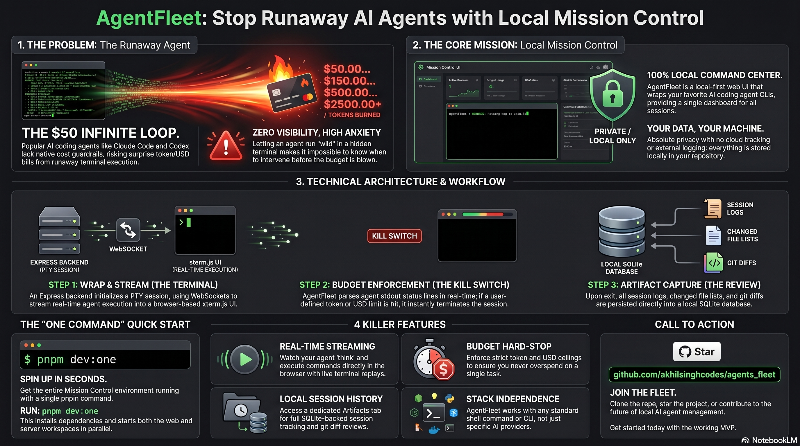

## ✨ Recently Shipped
- **PR #3: LiteLLM chat + terminal replay improvements**
  - Added LiteLLM-backed chat support with model selection and the same approve/reject tool flow used by Claude SDK
  - Improved persisted PTY replay by stripping alternate-screen escape sequences more reliably
  - Refreshed the README screenshots and demo assets to match the current MVP
- **PR #2: Real-time usage tracking**
  - Parse Claude Code status lines for more accurate token/cost counting instead of estimates
  - Budget enforcement that actually works
This repository contains a **working MVP**:
- pnpm workspace monorepo
- React + Vite + TypeScript “Mission Control” web app
- Node + Express + TypeScript server:
  - SQLite persistence (`data/agents_fleet.sqlite`)
  - session + terminal history HTTP APIs
  - WebSocket streaming (`/ws`):
    - live PTY output for shell/CLI sessions
    - live Claude SDK chat streaming + tool events
- shared TypeScript types (`packages/shared`)

## Demo

### Screenshots

**Mission control overview**

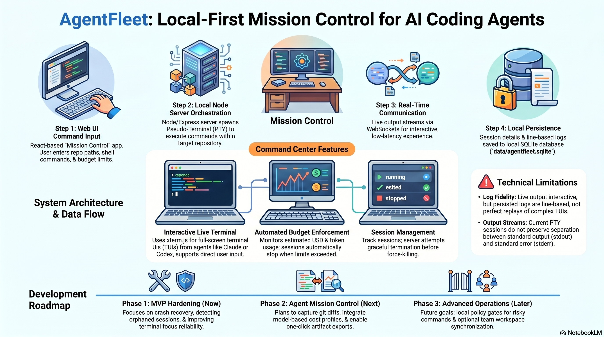

**Local-first architecture**

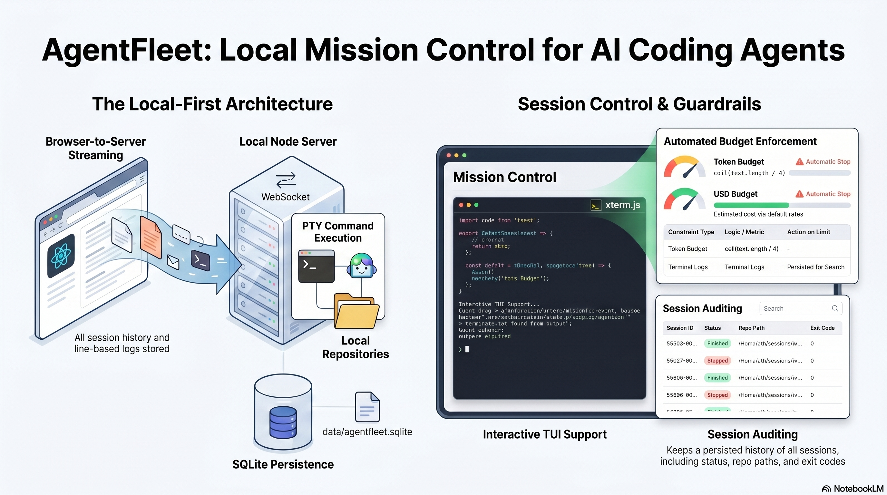

**Create a new session**

- Shell session

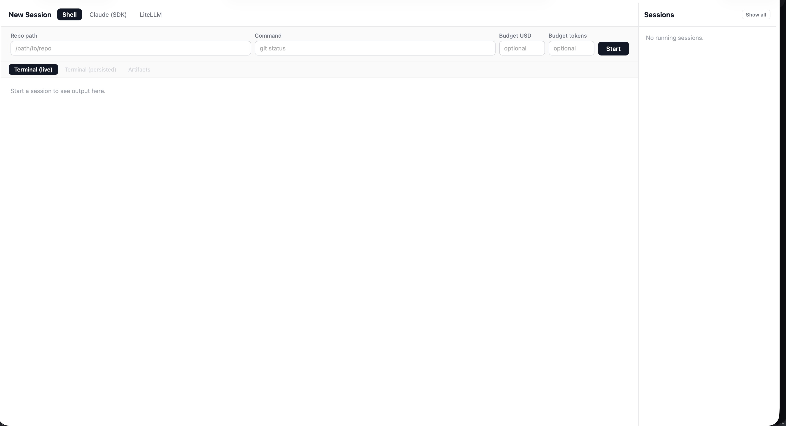

- Claude (SDK) session

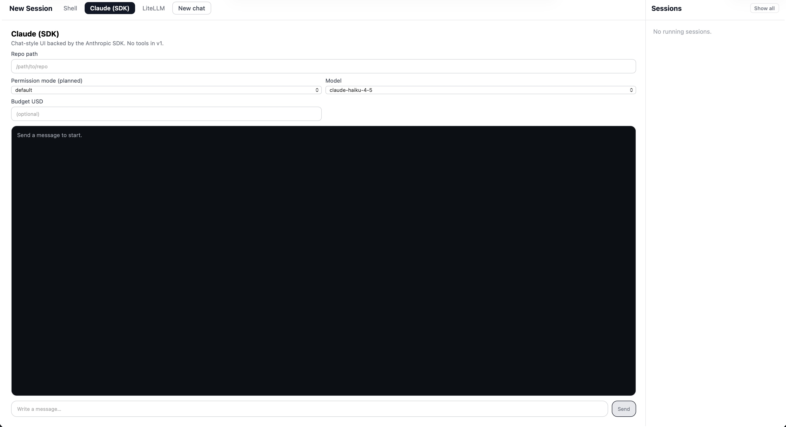

- LiteLLM session

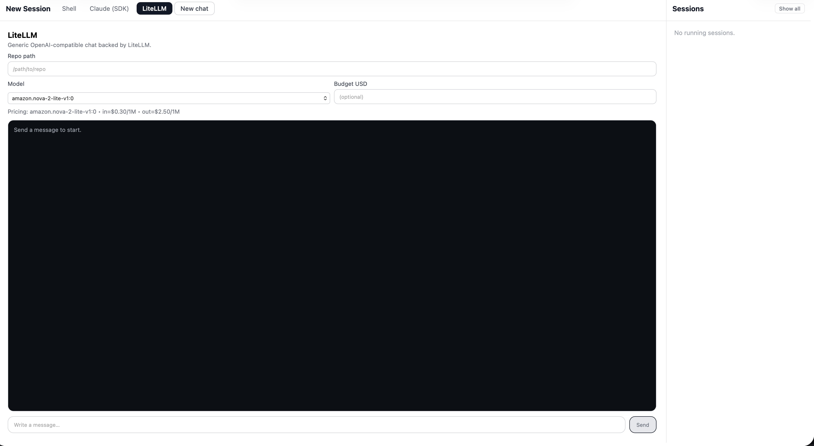

**Interactive sessions**

- Claude Code / PTY session

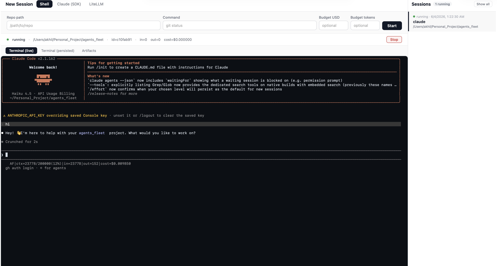

- OpenAI Codex / PTY session

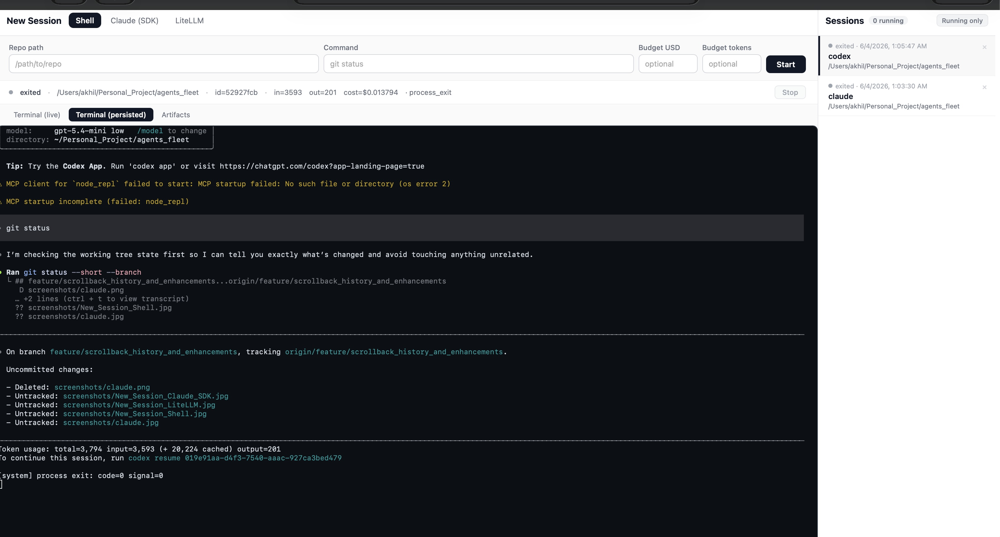

- Codex scrollback / persisted terminal replay

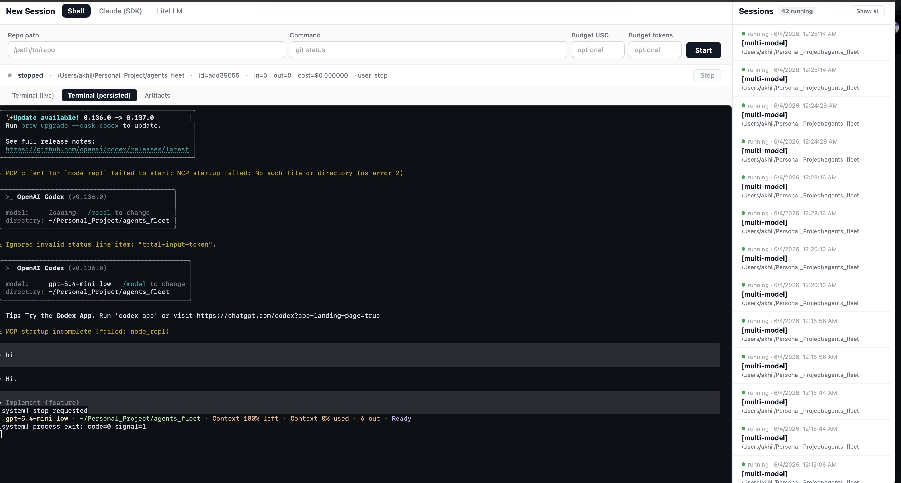

**Claude SDK chat flow**

- Chat conversation view

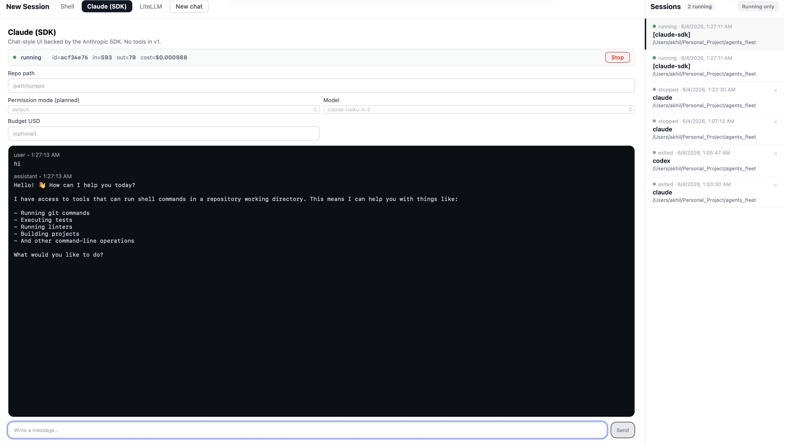

- Command approval gate

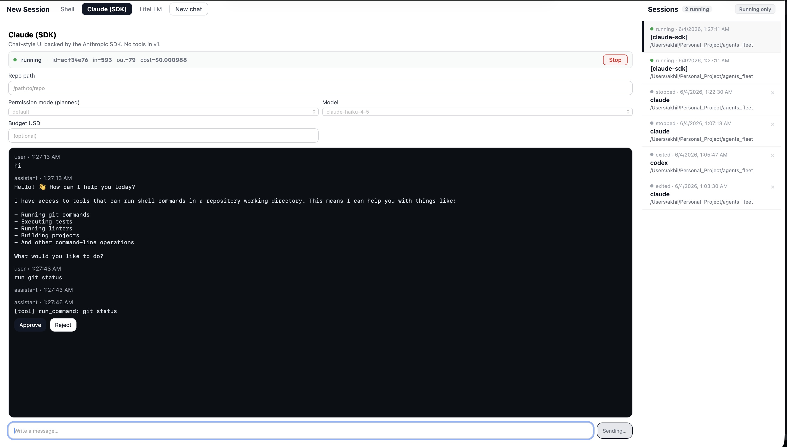

- Approval accepted

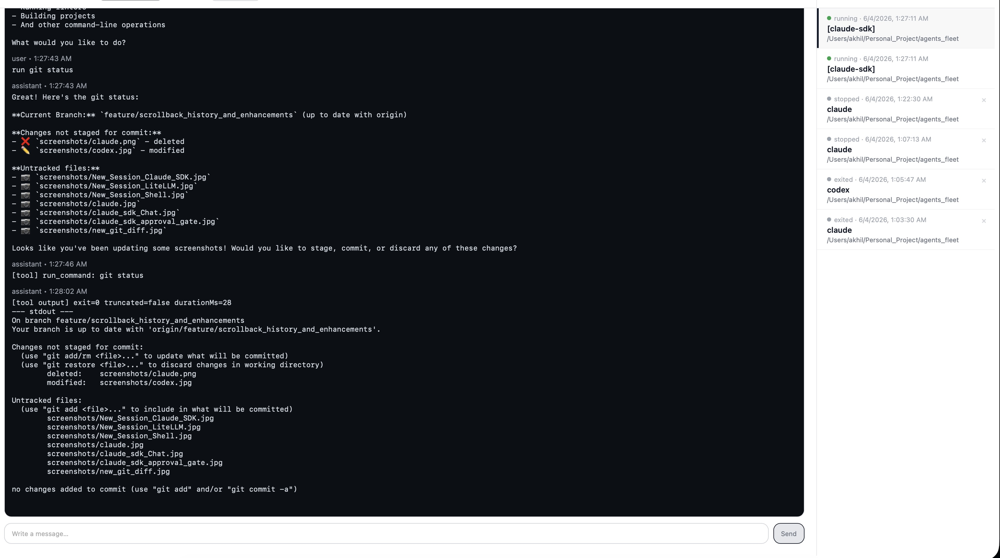

- Approval rejected

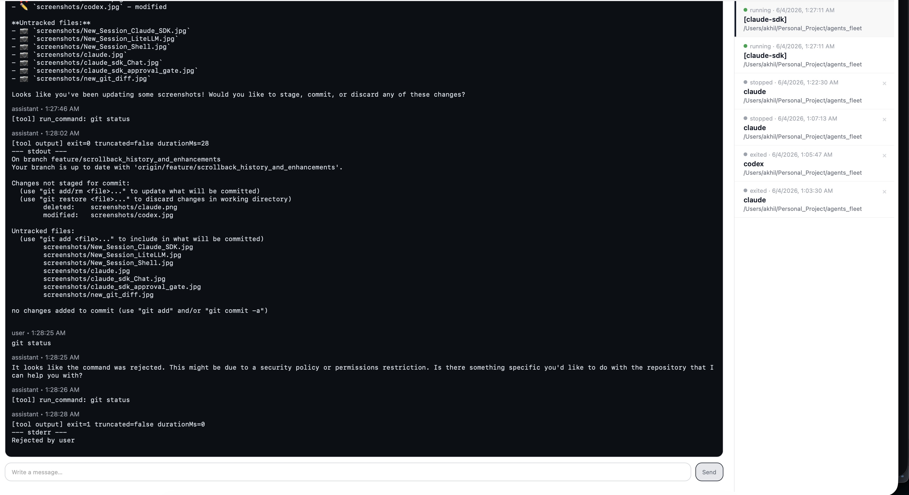

- Persisted chat history

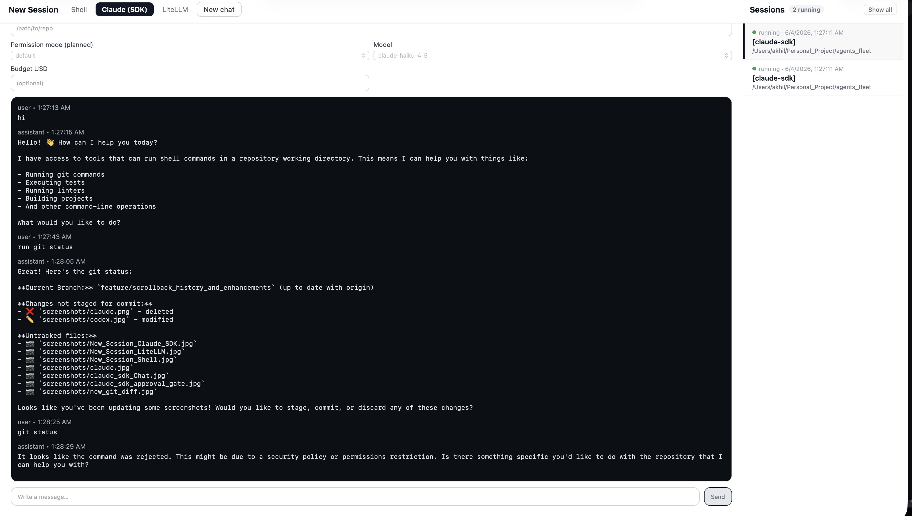

**Per-session artifacts (git diff snapshots)**

- Git diff snapshot

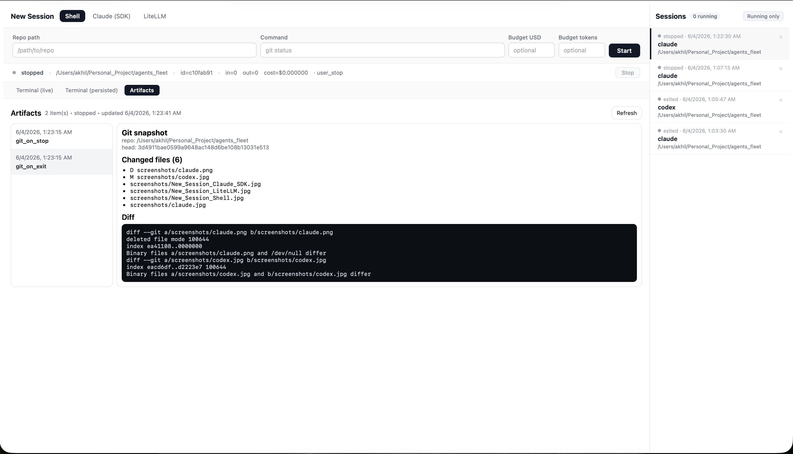

**SQLite persistence / debug views**

- Sessions table

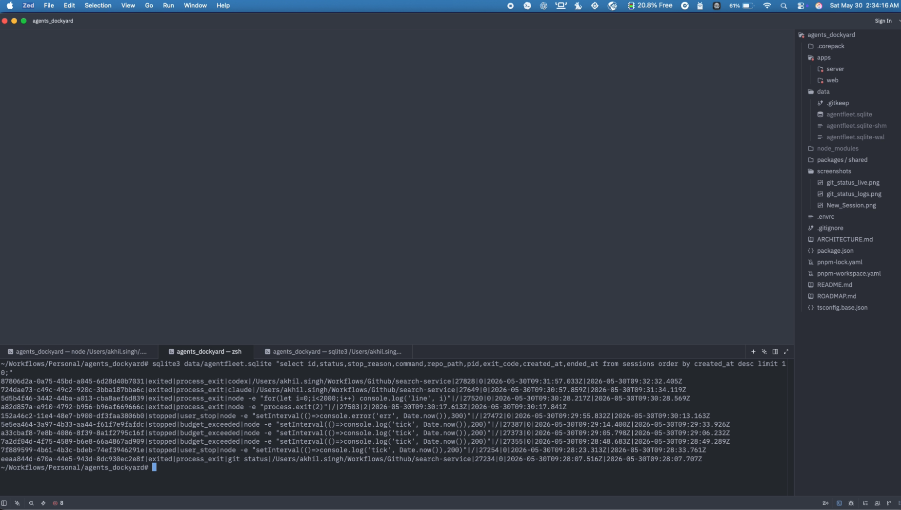

- Logs table

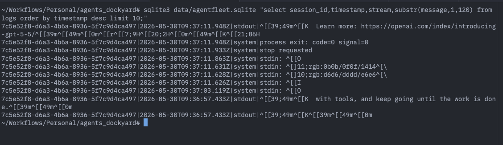

### Videos

- `screenshots/AgentFleet__AI_Mission_Control.mp4`

The MVP persists several tables in `data/agents_fleet.sqlite`:

- `sessions`: session metadata + budgets + estimated token/cost + stop reason
- `pty_chunks`: raw PTY stream (ANSI included) used for **Terminal (persisted)** replay
- `stdin_events`: input audit trail (stored separately; not injected into replay)
- `session_markers`: lifecycle markers like `stop_requested`, `budget_exceeded`, `process_exit`
- `session_artifacts`: per-session artifacts (currently: git snapshot with `changedFiles[]` + combined staged/unstaged `diff` captured on stop/exit)

> Earlier iterations used a line-based `logs` table. The current design persists terminal history as raw PTY chunks (`pty_chunks`) for xterm.js replay, which is much closer to real scrollback (especially for TUIs like Claude/Codex).

### Videos

> Tip: GitHub renders MP4 previews nicely in README. `.mov` files are ignored by default in `.gitignore` to avoid bloating git history.

- `screenshots/Agents_Fleet__Mission_Control_for_Your_Local_AI_Workers.mp4`

## Architecture
See `ARCHITECTURE.md`.


## Prerequisites
- Node.js 20.x
- pnpm (Corepack is fine)

## Setup
```bash
COREPACK_HOME="$PWD/.corepack" pnpm install
```

## Run (dev) — one command
```bash
pnpm dev:one
```

On first run, this may optionally prompt you for `ANTHROPIC_API_KEY` and save it to `.env.local` (gitignored). Press Enter to skip.

**Environment variables:**
- `ANTHROPIC_API_KEY` (required for Claude SDK chat)
- `LITELLM_BASE_URL` and `LITELLM_API_KEY` (optional for LiteLLM Chat via enterprise proxy)

This will:
- install dependencies (if needed)
- start `apps/server` + `apps/web` in parallel

Open: `http://localhost:5173`

## Run (dev) — manual (two terminals)
```bash
COREPACK_HOME="$PWD/.corepack" pnpm -C apps/server dev
COREPACK_HOME="$PWD/.corepack" pnpm -C apps/web dev
```

## Create a session
1. Open the web app (Vite prints the URL, typically `http://localhost:5173`).
2. Enter:
   - Repo path: absolute path to a local repository (must be a directory)
   - Command: any shell command to run in that repo

Example commands:
```bash
node -e "console.log('hello')"
git status
node -e "setinterval(()=>console.log('tick',Date.now()),200)"
node -e "setInterval(()=>console.log(Date.now()),200)"
claude
codex
```

## Interactive sessions (e.g. Claude)
### Claude Code / Codex (PTY)
- Start a session with command `claude` (or `codex` if installed).

#### (Recommended) Claude Code status line for accurate budget tracking
Claude Code can run a custom status line command that receives structured JSON about the current session (context window usage, estimated cost, etc.).

For the most reliable budget tracking in Agents Fleet, configure a **single-line** status line that prints parse-friendly key/value pairs.

1) Create the script:
```bash
#!/bin/bash
input=$(cat)

CTX_IN=$(echo "$input" | jq -r '.context_window.total_input_tokens // 0')
CTX_OUT=$(echo "$input" | jq -r '.context_window.total_output_tokens // 0')
CTX_SIZE=$(echo "$input" | jq -r '.context_window.context_window_size // 0')
CTX_PCT=$(echo "$input" | jq -r '.context_window.used_percentage // 0' | cut -d. -f1)

COST=$(echo "$input" | jq -r '.cost.total_cost_usd // 0')
COST_FMT=$(printf '$%.6f' "$COST")

# Single-line, parse-friendly output:
# Use a unique prefix + delimiter to make parsing reliable even with TUI redraws.
echo "AF|ctx=${CTX_IN}/${CTX_SIZE}(${CTX_PCT}%)|in=${CTX_IN}|out=${CTX_OUT}|cost=${COST_FMT}"
```
Save it as `~/.claude/agents_fleet_statusline.sh` and make it executable:
```bash
chmod +x ~/.claude/agents_fleet_statusline.sh
```

2) Update `~/.claude/settings.json`:
```json
{
  "statusLine": {
    "type": "command",
    "command": "~/.claude/agents_fleet_statusline.sh",
    "padding": 1,
    "refreshInterval": 1
  }
}
```

Notes:
- Requires `jq` to be installed (`brew install jq` on macOS).
- `cost.total_cost_usd` is an estimate computed client-side by Claude Code and may differ from your actual bill.
- Type directly into the **Terminal (live)** pane (xterm.js).
- Use **Terminal (persisted)** to replay and scroll through the recorded PTY output (xterm.js replay).

#### (Recommended) Codex status line for accurate budget tracking
Codex can also show session usage in a single-line status line. For Agents Fleet, the simplest reliable setup is to keep Codex’s built-in status line enabled and ensure it includes the usage fields below.

1) Update `~/.codex/config.toml`:
```toml
[tui]
status_line = ["model-with-reasoning","current-dir","context-remaining","context-used","total-input-token","total-output-tokens","weekly-limit","five-hour-limit","run-state","task-progress"]
status_line_use_color = true
```

2) Make sure the output stays on one line in the Codex TUI.

Notes:
- The config above matches the usage fields Agents Fleet can parse for budget tracking.
- If you change the field list, keep it single-line so PTY replay remains parse-friendly.
- Type directly into the **Terminal (live)** pane (xterm.js).
- Use **Terminal (persisted)** to replay and scroll through the recorded PTY output (xterm.js replay).

### Claude (SDK) chat (tool-calling)
**Prerequisite:** set `ANTHROPIC_API_KEY` (required). The server will reject Claude SDK requests if it’s missing.

- Switch to **Claude (SDK)** in the UI.
- Provide a repo path and chat normally.
- The assistant can propose `run_command` tool calls; you must **Approve** or **Reject** each command.
- Tool output is capped (100KB) and stored as session artifacts.

Screenshots:
- Claude SDK session stopped by budget


- Claude SDK tool call + output


- Claude SDK tool permission gate (Approve/Reject)


### LiteLLM Chat (proxy support)
**Use your enterprise URL and API key to access multiple models through a LiteLLM proxy.**

LiteLLM Chat allows you to:
- Use your enterprise/custom LiteLLM proxy endpoint
- Access models beyond Claude (OpenAI, Anthropic, etc.)
- Route requests through your own infrastructure

**Setup:**
1. Set environment variables:
```bash
export LITELLM_BASE_URL="https://your-litellm-proxy.com"
export LITELLM_API_KEY="your-api-key"
```

2. Switch to **LiteLLM** in the UI.
3. Provide a repo path and select your desired model from the dropdown.
4. Chat and use tools normally—the same Approve/Reject workflow as Claude SDK.

**Notes:**
- `LITELLM_BASE_URL` must be a valid HTTPS URL pointing to your LiteLLM proxy endpoint.
- `LITELLM_API_KEY` is your authentication key for the proxy.
- The available models depend on your LiteLLM proxy configuration.
- Tool output is capped (100KB) and stored as session artifacts, just like Claude SDK.

**Enterprise/Custom LLM Integration:**
If you're running a local or enterprise LiteLLM proxy, Agents Fleet will route all requests through your infrastructure, giving you full control and visibility over API costs and usage.

## Budgets (estimated)
- Optional `Budget USD` and/or `Budget tokens` apply to the entire session lifetime.
- Token estimation: `ceil(text.length / 4)`.
- Cost estimation:
  - shell/PTY sessions use the default rates in `apps/server/src/budget.ts`
  - Claude SDK sessions use a model-based pricing table (`computeModelCostUsd`) and SDK-reported usage when available.
- If a budget is exceeded, the session is stopped automatically and `stop_reason` becomes `budget_exceeded`.

> Note: USD cost is still an estimate unless you configure model pricing to match your account/contract.
>
> Configure pricing via a remote API (`PRICING_API_URL`, must be https) or via local overrides (`PRICING_JSON` inline JSON / `PRICING_JSON_PATH` file path). See `apps/server/src/pricing.ts` for schema + env vars.

## Stop a session
- Select a running session and click **Stop**.
- The server will attempt graceful termination first, then force-kill if needed (best-effort, cross-platform).

## Per-session artifacts (git diff snapshots)
On session **stop** and/or **exit**, Agents Fleet can capture a git snapshot for the session repo and store it in SQLite.

- UI: open the **Artifacts** tab (next to Terminal tabs) to view changed files + diff.
- Storage: `session_artifacts` table.
- Toggle: set `AGENTS_FLEET_CAPTURE_GIT_ON_END=0` to disable capture.

## Scripts
- `pnpm dev:one` installs deps if needed and runs dev for all workspaces (web + server).
- `pnpm dev` runs dev for all workspaces (web + server) in parallel.
- `pnpm check` runs `lint` + `typecheck` + `test` + `build`.
- `pnpm build` builds all workspaces.
- `pnpm typecheck` runs TypeScript checks across workspaces.

## Tests
```bash
COREPACK_HOME="$PWD/.corepack" pnpm -C apps/server test
```

## Notes
- If you see Corepack cache permission errors, the `COREPACK_HOME="$PWD/.corepack"` prefix keeps Corepack’s cache inside the repo.

## Data location
- SQLite DB: `data/agents_fleet.sqlite` (local only; do not commit).

## Known limitations
- PTY sessions do not preserve stdout/stderr separation.
- Token/cost is an estimate unless the CLI provides actual usage.
- Some TUIs (notably Claude) may clear/restore the alternate screen on exit. The persisted replay is a faithful stream replay, so end-of-session scrollback may differ from what you remember seeing just before exit.
