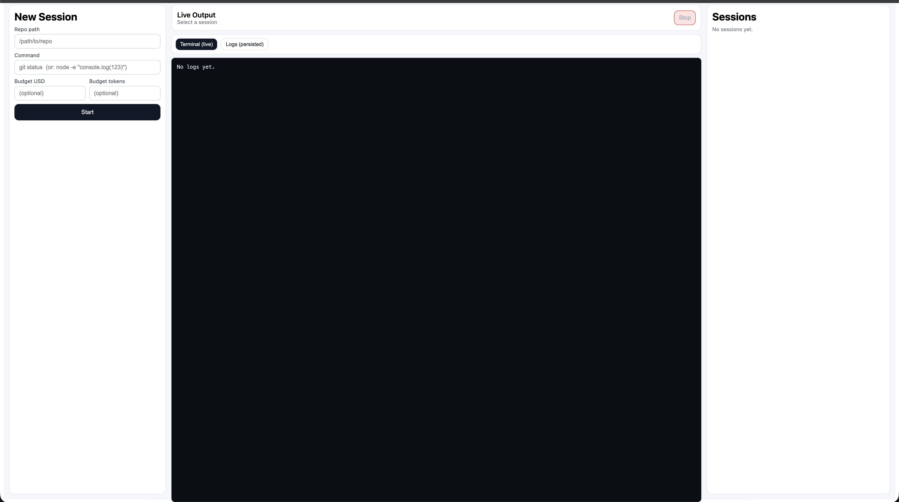
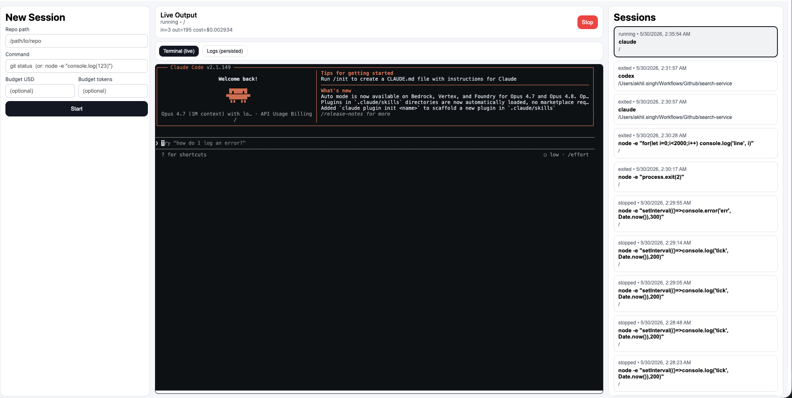
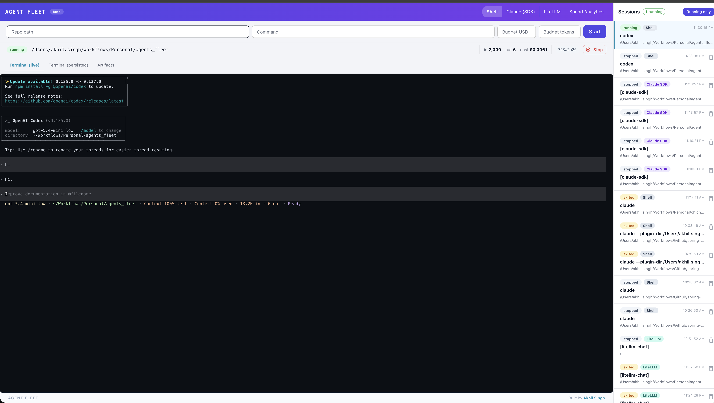
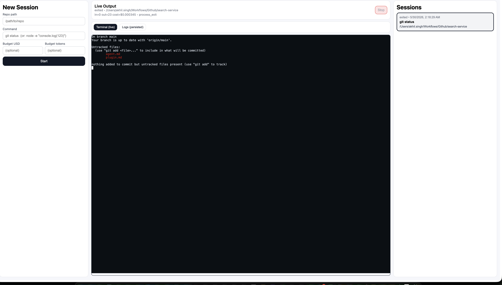
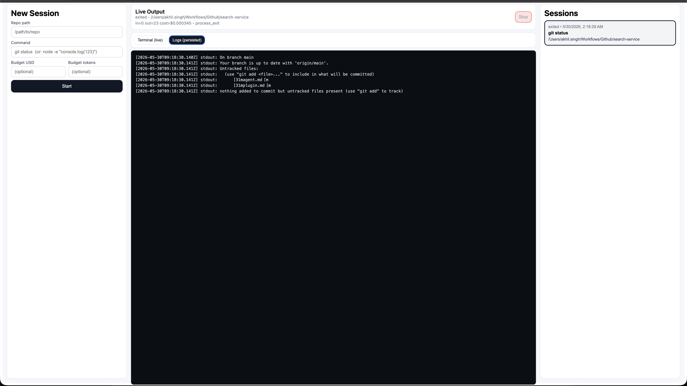
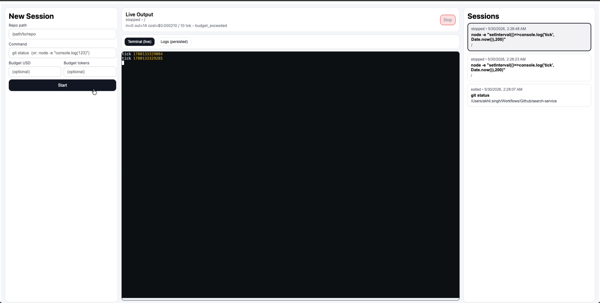
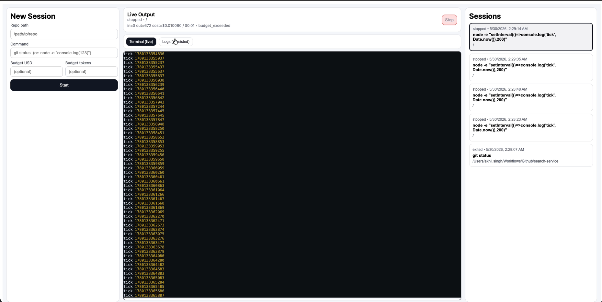
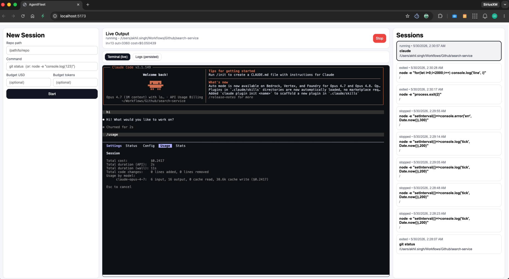

# Agents Fleet (prototype)

[](https://github.com/akhilsinghcodes/agents_fleet/actions/workflows/ci.yml)

Local-first “mission control” for AI coding agent CLIs (and any shell commands): launch sessions in a repo, stream live output to a web UI, stop them, and keep a persisted history.

This repository contains a **working MVP**:
- pnpm workspace monorepo
- React + Vite + TypeScript “Mission Control” web app
- Node + Express + TypeScript server:
  - SQLite persistence (`data/agents_fleet.sqlite`)
  - session + terminal history HTTP APIs
  - WebSocket live PTY streaming (`/ws`)
- shared TypeScript types (`packages/shared`)

## Demo

### Screenshots

**New session form**



**Live terminal (interactive agents)**

- Claude Code (interactive TUI rendered via xterm.js)



- OpenAI Codex (interactive)



**Live output vs persisted terminal history**

- Terminal (live)



- Terminal (persisted)



**Budget enforcement (auto-stop)**

- Token budget cutoff



- USD budget cutoff



**Cost estimate vs actual (CLI-reported)**



**SQLite persistence (debug views)**


The MVP persists several tables in `data/agents_fleet.sqlite`:

- `sessions`: session metadata + budgets + estimated token/cost + stop reason
- `pty_chunks`: raw PTY stream (ANSI included) used for **Terminal (persisted)** replay
- `stdin_events`: input audit trail (stored separately; not injected into replay)
- `session_markers`: lifecycle markers like `stop_requested`, `budget_exceeded`, `process_exit`

> Earlier iterations used a line-based `logs` table. The current design persists terminal history as raw PTY chunks (`pty_chunks`) for xterm.js replay, which is much closer to real scrollback (especially for TUIs like Claude/Codex).

### Videos

> Tip: GitHub renders MP4 previews nicely in README. `.mov` files are ignored by default in `.gitignore` to avoid bloating git history.

- `screenshots/Agents_Fleet__Mission_Control_for_Your_Local_AI_Workers.mp4`

## Architecture
See `ARCHITECTURE.md`.


## Prerequisites
- Node.js 20.x
- pnpm (Corepack is fine)

## Setup
```bash
COREPACK_HOME="$PWD/.corepack" pnpm install
```

## Run (dev) — one command
```bash
pnpm dev:one
```

This will:
- install dependencies (if needed)
- start `apps/server` + `apps/web` in parallel

Open: `http://localhost:5173`

## Run (dev) — manual (two terminals)
```bash
COREPACK_HOME="$PWD/.corepack" pnpm -C apps/server dev
COREPACK_HOME="$PWD/.corepack" pnpm -C apps/web dev
```

## Create a session
1. Open the web app (Vite prints the URL, typically `http://localhost:5173`).
2. Enter:
   - Repo path: absolute path to a local repository (must be a directory)
   - Command: any shell command to run in that repo

Example commands:
```bash
node -e "console.log('hello')"
git status
node -e "setinterval(()=>console.log('tick',Date.now()),200)"
node -e "setInterval(()=>console.log(Date.now()),200)"
claude
codex
```

## Interactive sessions (e.g. Claude)
- Start a session with command `claude` (or `codex` if installed).
- Type directly into the **Terminal (live)** pane (xterm.js).
- Use **Terminal (persisted)** to replay and scroll through the recorded PTY output (xterm.js replay).

## Budgets (estimated)
- Optional `Budget USD` and/or `Budget tokens` apply to the entire session lifetime.
- The server estimates tokens as `ceil(text.length / 4)` and computes estimated cost using default rates.
- If a budget is exceeded, the session is stopped automatically and `stop_reason` becomes `budget_exceeded`.

## Stop a session
- Select a running session and click **Stop**.
- The server will attempt graceful termination first, then force-kill if needed (best-effort, cross-platform).

## Scripts
- `pnpm dev:one` installs deps if needed and runs dev for all workspaces (web + server).
- `pnpm dev` runs dev for all workspaces (web + server) in parallel.
- `pnpm check` runs `lint` + `typecheck` + `test` + `build`.
- `pnpm build` builds all workspaces.
- `pnpm typecheck` runs TypeScript checks across workspaces.

## Tests
```bash
COREPACK_HOME="$PWD/.corepack" pnpm -C apps/server test
```

## Notes
- If you see Corepack cache permission errors, the `COREPACK_HOME="$PWD/.corepack"` prefix keeps Corepack’s cache inside the repo.

## Data location
- SQLite DB: `data/agents_fleet.sqlite` (local only; do not commit).

## Known limitations
- PTY sessions do not preserve stdout/stderr separation.
- Token/cost is an estimate unless the CLI provides actual usage.
- Some TUIs (notably Claude) may clear/restore the alternate screen on exit. The persisted replay is a faithful stream replay, so end-of-session scrollback may differ from what you remember seeing just before exit.
